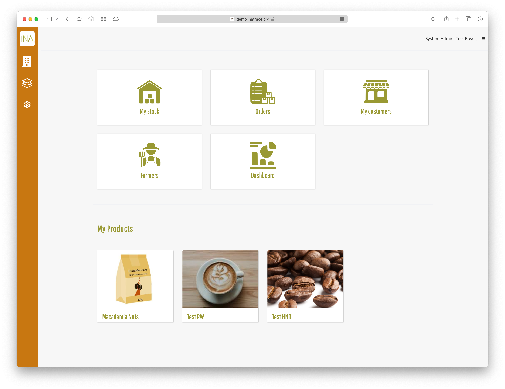
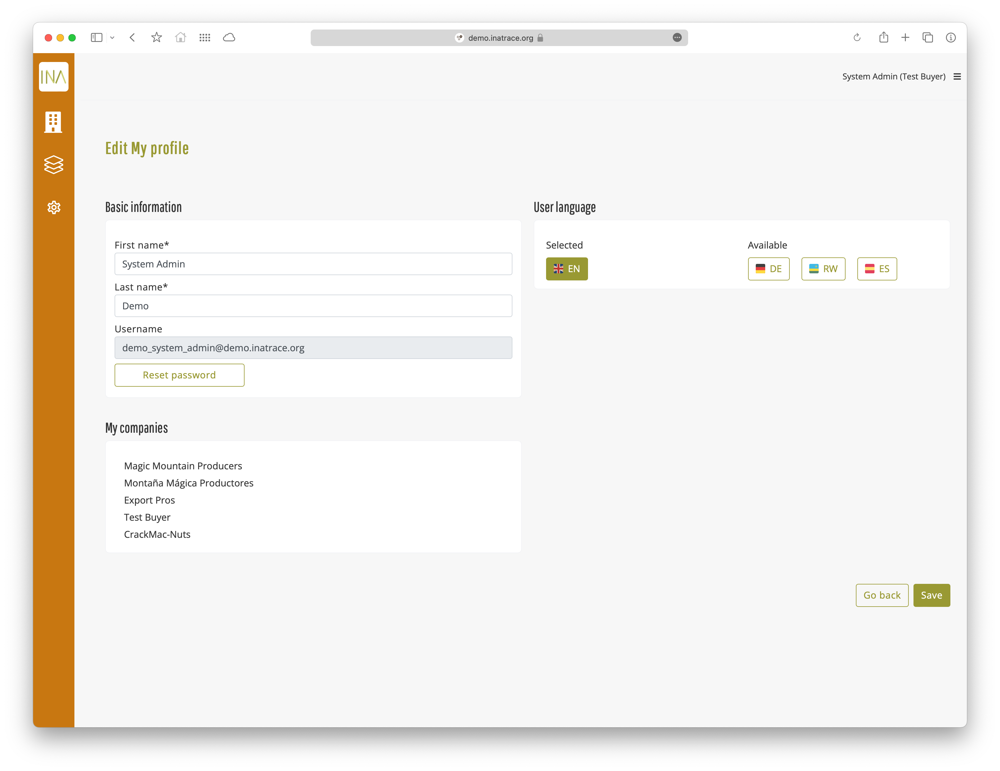
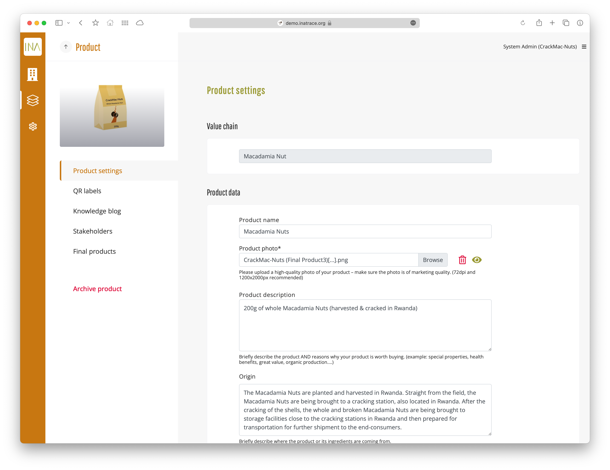
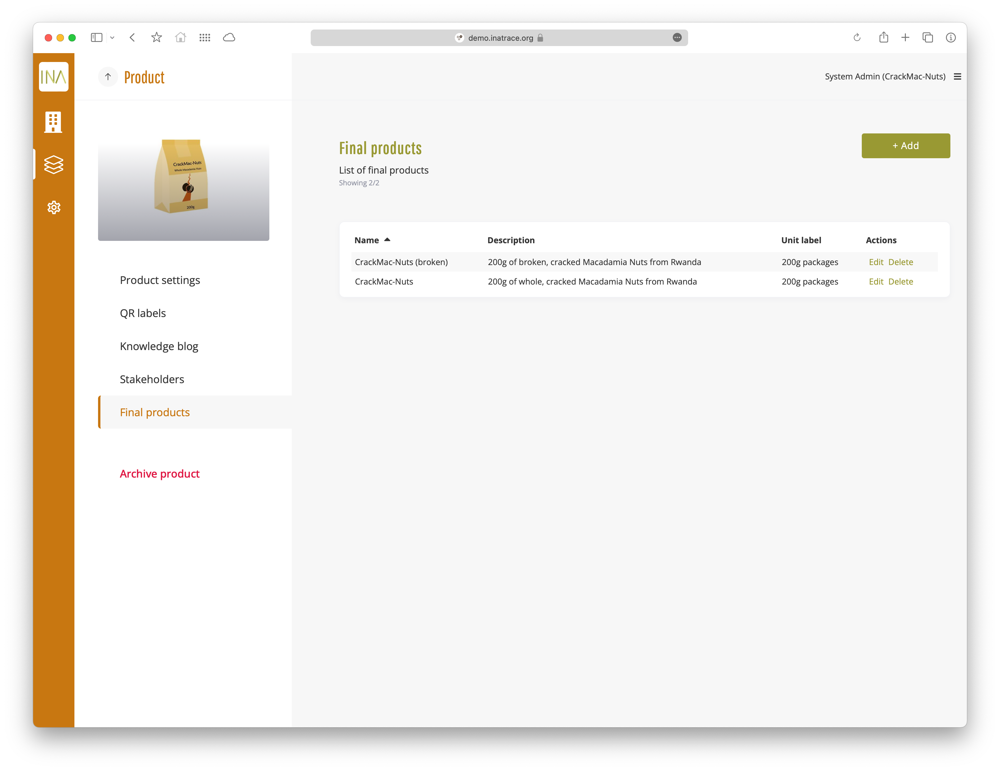
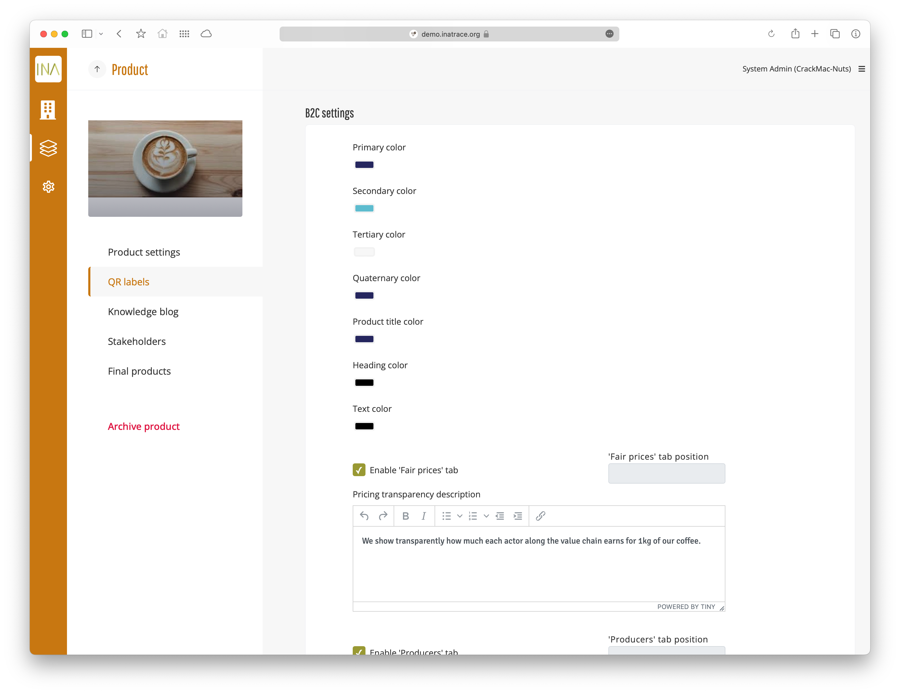
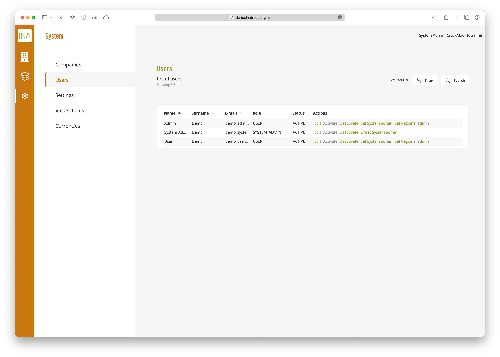
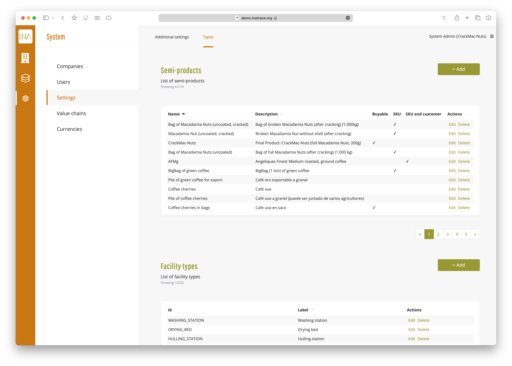
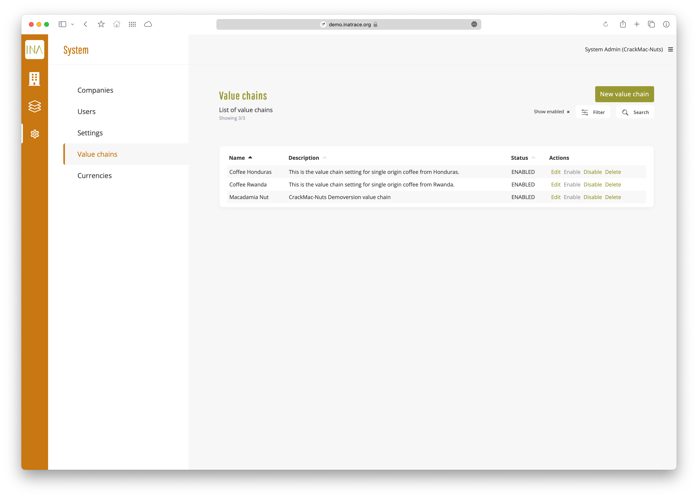

# INATrace

**INATrace** es un sistema abierto de trazabilidad basado en blockchain para cadenas de suministro agrícolas (ejemplo: café), diseñado para brindar transparencia, confianza y eficiencia. Digitaliza las cadenas de suministro, conecta a todos los actores y facilita la gestión de calidad y precios justos.

El proyecto consta de tres componentes principales:

- [Frontend Angular (este repositorio)](https://github.com/INATrace/fe/tree/main)
- [Backend Java](https://github.com/INATrace/backend/tree/main)
- [Red Coffee Network](https://github.com/INATrace/coffee-network/tree/main)

---

# Tabla de Contenidos
1. [Novedades principales](#novedades-principales)
2. [Requisitos y compatibilidad](#requisitos-y-compatibilidad)
3. [Instalación y primeros pasos](#instalación-y-primeros-pasos)
4. [Guía de uso y flujo de usuario](#guía-de-uso-y-flujo-de-usuario)
5. [Funcionalidades principales](#funcionalidades-principales)
6. [Construcción y despliegue](#construcción-y-despliegue)
7. [Solución de problemas frecuentes](#solución-de-problemas-frecuentes)
8. [Contribución](#contribución)
9. [Licencia](#licencia)

---

# Novedades principales
Esta versión incluye:
- Soporte multi-tenant y para múltiples cadenas de valor configurables.
- Gestión flexible de compañías, productos y roles.
- Importación masiva de agricultores desde Excel.
- Integración con monedas y tipos de cambio diarios.
- Mejoras en compras, procesamiento y pagos.

# Requisitos y compatibilidad
- **Node.js 14.x** (no compatible con versiones superiores)
- **Angular 10**
- **Docker** (opcional para despliegue)
- IDE recomendado: WebStorm o VS Code
- Plugins útiles para VS Code:
  - Debugger for Chrome
  - EditorConfig
  - npm support
  - HTML Format
  - TSLint

> **Nota:** Si usas una versión de Node superior, puedes encontrar errores de compatibilidad. Usa `nvm` para cambiar de versión si es necesario.

# Instalación y primeros pasos
1. Clona este repositorio: `git clone https://github.com/INATrace/fe.git`
2. Instala dependencias: `npm install`
3. Abre el proyecto en tu IDE preferido.
4. Genera el cliente API desde el backend Java: `npm run generate-api` (requiere backend corriendo y configurado).
5. Configura el entorno de desarrollo:
   - Copia `src/environments/environment.ts` a `src/environments/environment.dev.ts`.
   - Ajusta las variables necesarias (verifica claves, endpoints y tokens según tu entorno y el README original).
6. Si usas integración Beybo, añade las claves requeridas en `environment.ts`.
7. Inicia el servidor Angular en modo desarrollo: `npm run dev`

---
# Guía de uso y flujo de usuario

## 1. Registro y activación de cuenta
- Los nuevos usuarios deben registrarse con nombre, apellido, correo electrónico válido y contraseña, aceptando los términos.
- Se enviará un enlace de confirmación por correo. **Debes activarlo antes de poder iniciar sesión.**
- Un administrador debe activar la cuenta tras la confirmación.

## 2. Asignación a empresa
- Tras el registro y activación, tu usuario debe estar asignado a una empresa para acceder a las funcionalidades.
- Si ves el mensaje: _"Por el momento usted no tiene empresas asignadas. Contacte a su administrador"_, solicita a un administrador que te asigne a una empresa desde el panel de administración.

## 3. Inicio de sesión
- Usa tu correo electrónico y contraseña para iniciar sesión.
- Si tienes varias empresas, podrás seleccionar la activa desde tu perfil.

---

## Página de bienvenida

Esta es la página de inicio en [inatrace.org](https://inatrace.org/). Los usuarios existentes pueden iniciar sesión y los nuevos pueden informarse sobre el registro.


## Registro

Los nuevos usuarios deben ingresar nombre, apellido, correo y contraseña, y aceptar los términos. Se envía un enlace de confirmación por correo y luego un administrador debe activar la cuenta.


## Inicio



En la barra lateral izquierda se encuentran enlaces a: Inicio, Compañía, Productos y Configuración (solo administradores). Los productos del usuario se muestran en el centro, junto a accesos rápidos a stock, pedidos, clientes, agricultores, recolectores y dashboard.

En la esquina superior derecha hay un menú expandible con accesos rápidos, perfil de usuario y cierre de sesión. Si el usuario pertenece a varias compañías, puede seleccionar la activa desde el perfil.



# Funcionalidades principales

## Gestión de productos
- Cada empresa puede registrar y gestionar sus productos, incluyendo información relevante (nombre, imagen, origen, datos de sostenibilidad, etc).
- Se pueden generar etiquetas QR para la trazabilidad del producto.
- Los stakeholders (empresas participantes) pueden tener distintos roles: comprador, importador, exportador, productor, asociación, procesador, comerciante.




### Productos finales

Productos de venta al consumidor final.



### Configuración B2C

La página pública B2C permite personalizar colores, fuentes e imágenes para cumplir con la identidad corporativa. La configuración se hereda entre producto y etiquetas QR, pero puede ser sobrescrita por etiqueta.

Valores personalizables: colores, pestañas visibles, fuentes, imágenes de encabezado y pie.



## Compañías

La pestaña muestra la compañía activa y la pestaña "Entregas" por defecto.

### Entregas

Muestra entregas de semiproductos de agricultores y recolectores. Se pueden registrar nuevas entregas.


### Procesamiento

Registro de acciones de procesamiento (ej. tostar café). Se definen insumos, productos y cantidades, y se pueden añadir evidencias.


### Pagos

Registro de pagos a agricultores y recolectores.


### Agricultores y recolectores

Registro de datos personales y bancarios, historial de pagos y código QR único para cada persona.


## Dashboard

Contiene representaciones gráficas de datos de la compañía: entregas y desempeño de procesamiento por periodo. Se puede exportar la información en Excel, PDF o CSV.


## Configuración

Solo para administradores. Permite gestionar compañías, usuarios, cadenas de valor, monedas y otros parámetros del sistema.


### Usuarios

Lista de usuarios del sistema. Se pueden editar, activar/desactivar, y asignar roles de administrador o regional.



### Tipos y constantes

En la pestaña "Tipos" se pueden gestionar semiproductos, tipos de instalaciones, unidades de medida, tipos y campos de evidencia, y tipos de producto.



### Cadenas de valor

Permite crear y editar cadenas de valor, que contienen tipos de instalaciones, unidades y otras constantes.



### Monedas

El sistema soporta 168 monedas, habilitadas manualmente por un administrador. Los datos provienen de [exchangeratesapi.io](https://exchangeratesapi.io/).


# Construcción y despliegue

## Despliegue profesional (recomendado)

Para producción, se recomienda desplegar el frontend usando Docker y configurar las variables de entorno dinámicamente mediante el archivo `src/assets/env.js`.

### 1. Configuración de variables de entorno

Edita `src/assets/env.js` para definir los endpoints reales del backend y otros parámetros:

```js
window['env']['environmentName'] = 'production';
window['env']['appBaseUrl'] = 'http://TU_IP_O_DOMINIO:8080';
window['env']['qrCodeBasePath'] = '/api/stock-order';
window['env']['relativeFileUploadUrl'] = '/api/document';
window['env']['relativeFileUploadUrlManualType'] = '/api/document?type=MANUAL';
window['env']['relativeImageUploadUrl'] = '/api/image';
window['env']['relativeImageUploadUrlAllSizes'] = '/api/image';
window['env']['googleMapsApiKey'] = '';
window['env']['tokenForPublicLogRoute'] = '';
window['env']['mapboxAccessToken'] = '';
window['env']['beycoAuthURL'] = '';
window['env']['beycoClientId'] = '';
```

> **Nota:** Usa rutas relativas (`/api/...`) si frontend y backend están bajo el mismo dominio, o absolutas si están en servidores separados.

### 2. Construcción y despliegue con Docker

Ejecuta los siguientes comandos desde la raíz del proyecto:

```bash
# Construir la imagen Docker
sudo docker build -t inatrace-fe:latest .

# Ejecutar el contenedor exponiendo el puerto 80
sudo docker run -d --name inatrace-fe -p 80:80 inatrace-fe:latest
```

Puedes personalizar el nombre, la etiqueta y los puertos según tu infraestructura. Para entornos profesionales, monta volúmenes o usa variables de entorno externas si lo requieres.

### 3. Acceso

Accede a la aplicación desde tu navegador en `http://TU_IP_O_DOMINIO`.

### 4. Documentación técnica

Consulta la guía `/docs/tecnico/guia-cicd-frontend.md` para pasos detallados de integración, recomendaciones de seguridad, HTTPS y despliegue automatizado.

## Despliegue local para desarrollo

1. Instala dependencias: `npm install`
2. Configura el entorno copiando y editando `src/environments/environment.ts` a `environment.dev.ts`.
3. Inicia el servidor de desarrollo: `npm run dev`

---
# Solución de problemas frecuentes

- **Error "Empty key" al iniciar sesión:**
  - El backend requiere una clave secreta JWT configurada. Añádela en las variables de entorno o en `application.properties` (`jwt.secret=unaClaveSegura`).

- **Mensaje "No tiene empresas asignadas":**
  - Solicita a un administrador que te asigne a una empresa desde el panel de administración.

- **Errores de compatibilidad de Node:**
  - Usa Node 14.x. Si tienes otra versión, instala y selecciona la correcta con `nvm`.

- **Problemas de conexión frontend-backend:**
  - Verifica que la IP y el puerto del backend estén accesibles y correctamente configurados en el proxy y en los archivos de entorno.

- **No recibes el correo de activación:**
  - Revisa la configuración de envío de correos en el backend y la carpeta de spam.

---
# Contribución

¡Todas las contribuciones son bienvenidas! Consulta `CONTRIBUTING.md` para comenzar.

# Licencia

Copyright (c) 2023 Antje ECG d.o.o., GIZ - Deutsche Gesellschaft für Internationale Zusammenarbeit GmbH, Sunesis ltd.

Este programa es software libre: puedes redistribuirlo y/o modificarlo bajo los términos de la Licencia Pública General Affero de GNU publicada por la Free Software Foundation, ya sea la versión 3 de la Licencia, o (a tu elección) cualquier versión posterior.

Este programa se distribuye con la esperanza de que sea útil, pero SIN NINGUNA GARANTÍA; incluso sin la garantía implícita de COMERCIABILIDAD o IDONEIDAD PARA UN PROPÓSITO PARTICULAR. Consulta la Licencia Pública General Affero de GNU para más detalles.

Deberías haber recibido una copia de la Licencia junto a este programa. Si no, visita <http://www.gnu.org/licenses/>.
