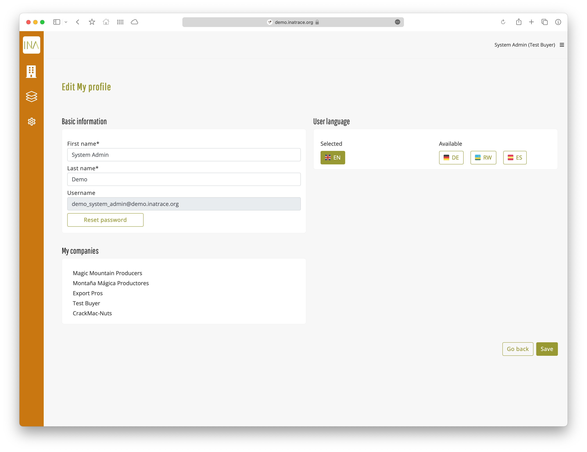
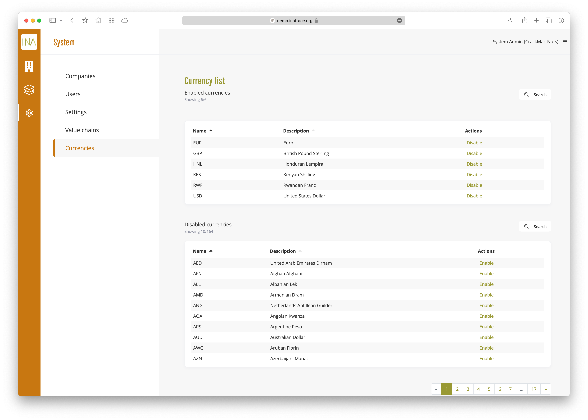

# INATrace

Open-source blockchain-based track and trace system for an agricultural commodities (such as coffee) supply
chain run. It provides transparency and creation of trust through
digitalization of supply chains, connects every actor along the supply chain, assures quality and fair pricing.

Project is composed from 3 parts:

* [Angular frontend](https://github.com/INATrace/fe/tree/main)
* [Java backend](https://github.com/INATrace/backend/tree/main)
* [Coffee network](https://github.com/INATrace/coffee-network/tree/main)

# INATrace 2
This new major release includes new functionalities, refactorings, optimizations and bugfixes. The most important additions and changes are:
* Added support for generic value chains. Different value chains with it's specific settings can now be configured in the system.
* Multi-tenant system support.
* Reorganized the content in the Product section. This section now includes only the content that is related to a product.
* Introduced a new section "Company". This section includes all the content that is related with the company's work process within the value chain.
* The configuration of farmers and collectors is decoupled from the product, and it's part of the Company section.
* Added support for importing farmers from a provided Excel file.
* The company customers are now decoupled from the Stakeholders in the product section and are configured as part of the Company section.
* The configuration of facilities and processing actions is now part of the company's profile.
* The semi-products configuration is now part of the system settings instead of the product section.
* Reorganized the content of the Value chain tab inside the Stakeholders section. The Value chain now includes new company roles. Added is also a section for product admin companies.
* Added support for defining Processing evidence fields in the system settings.
* Translation for facilities, processing actions, semi-products and processing evidence types and fields can be provided in the system as part of it's definition.
* Added support for currencies in the system. The enabled currencies can be selected in the system settings. These currencies then appear as select options in various parts of the system where the user is expected to select a currency.
* Added exchange rates for the enabled currencies that are synced on a daily basis. The currencies data is provided by the https://exchangeratesapi.io/ API.
* The product section now includes Final products. Final products represent the output of a final processing. The final products can be configured by the product admin company.
* When placing customer order, now we select a final product instead of a sellable semi-product.
* Added support for new types of processing actions.
* Added support for bulk purchases for semi-products.
* Various changes and addition of new functionalities for purchases, processing and payments.

# Frontend

## Installing / Getting started

#### Requirements
* Node 14
* Angular 10
* Docker
* WebStorm or VS Code (recommended)
* VS Code pluggins:
  * Debugger for Chrome
  * EditorConfig for VS Code
  * npm support for VS Code
  * HTML Format (from Mohamed)
  * TSLint

#### How to run
1. Clone the repository
	
2. Run ```npm install```

3. Open project in IDE of choice

4. Generate API client from Java backend by running `npm run generate-api`

5. Add development environment as `environment.dev.ts` by copying `environment.ts` and adding default values for configuration keys besides window environment (e.g. `environmentName: window['env']['environmentName'] || 'DEV'`)
   1. `environmentName`: `'DEV'`
   2. `appBaseUrl`: `'http://localhost:4200'`
   3. `qrCodeBasePath`: `'q-cd'`
   4. `relativeFileUploadUrl`: `'/api/common/document'`
   5. `relativeFileUploadUrlManualType`: `'/api/common/document'`
   6. `relativeImageUploadUrl`: `'/api/common/image'`
   7. `relativeImageUploadUrlAllSizes`: `'/api/common/image'`
   8. `googleMapsApiKey`: have to obtain a key yourself

6. Run Angular server with `npm run dev`

## Screens

### Welcome page

This is the welcome page at [inatrace.org](https://inatrace.org/). From here, existing users can login by clicking "Login" in the top right corner. New users can click on either one of the two "Get started" buttons to register. 


### Registration

New users must enter their name, surname, email and password. The terms and conditions have to be accepted. The submitted email address receives a confirmation link to confirm the email address. After confirming the email, a system admin must activate the account.


### Home


This is the home page. In the left sidebar from top to bottom, we have the following links:
- Home
- Company
- Products
- Settings (Admin only)

The current user's products are displayed in the center, along with quick access links to stock, orders, customers, farmers and collectors.

In the top right corner, an expandable menu contains quick links, user profile settings and a logout button.

If the user has multiple companies, an active company can be selected in the "User profile" section.



### Settings

This section is dedicated to system settings. Settings are accessible by clicking the cog icon in the sidebar. This menu is only available for system administrators.

#### Companies

Here, new companies can be added and existing ones can be edited.


#### Users

This is the list of system users. To show all users, the "My users" filter needs to be deactivated. Users can be edited, activated, deactivated and promoted or demoted out of the admin role.

Users who confirmed their emails can be activated by clicking "Activate". After that, they can login and start using the app.


#### Settings

Under the "Settings" page and "Types" tab, we find constants and system-level values like semi-products, facility types, measurement units, grade abbreviations, processing evidence types and processing evidence fields. Add, edit or remove any of these values to fit your use case.


#### Value chains

Value chains are listed on this tab. From here, create a new or edit an existing value chain. Value chains contains facility types, measuring unit types and other constants added in the types settings. 


#### Currencies

The system supports 168 different currencies, provided by [exchangeratesapi.io](https://exchangeratesapi.io/). To use a currency, an admin has to manualy activate it before it can be selected in currency lists.

To search for a currency, click the "Search" button above the enabled or disabled list and type the ISO code or full name.  



## Building

Builds are done using Docker with the build script located in `Dockerfile`.

To build, tag and push an image run `docker-build.sh`. See the file for a detailed command syntax.

To build and tag an image localy with name `inatrace-be` and version `2.4.0` run:

```
./docker-build.sh inatrace-be 2.4.0
```

To build and tag an image with name `inatrace-be`, version `2.4.0` and push it to a remote Docker registry `my-docker-registry` run:

```
./docker-build.sh my-docker-registry/inatrace-be 2.4.0 push
```

## Contribution

Project INATrace welcomes contribution from everyone. See CONTRIBUTING.md for help to get started.

## License 

Copyright (c) 2020 Antje ECG d.o.o., GIZ - Deutsche Gesellschaft für Internationale Zusammenarbeit GmbH

This program is free software: you can redistribute it and/or modify
it under the terms of the GNU Affero General Public License as published
by the Free Software Foundation, either version 3 of the License, or
(at your option) any later version.

This program is distributed in the hope that it will be useful,
but WITHOUT ANY WARRANTY; without even the implied warranty of
MERCHANTABILITY or FITNESS FOR A PARTICULAR PURPOSE.  See the
GNU Affero General Public License for more details.

You should have received a copy of the GNU Affero General Public License
along with this program.  If not, see <http://www.gnu.org/licenses/>.
