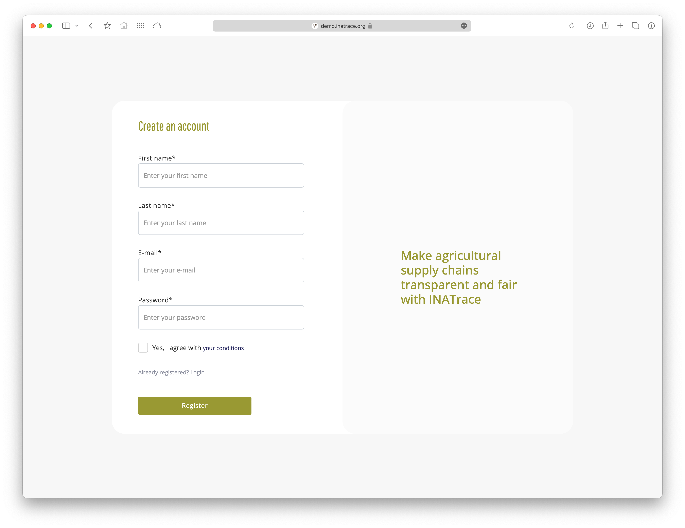
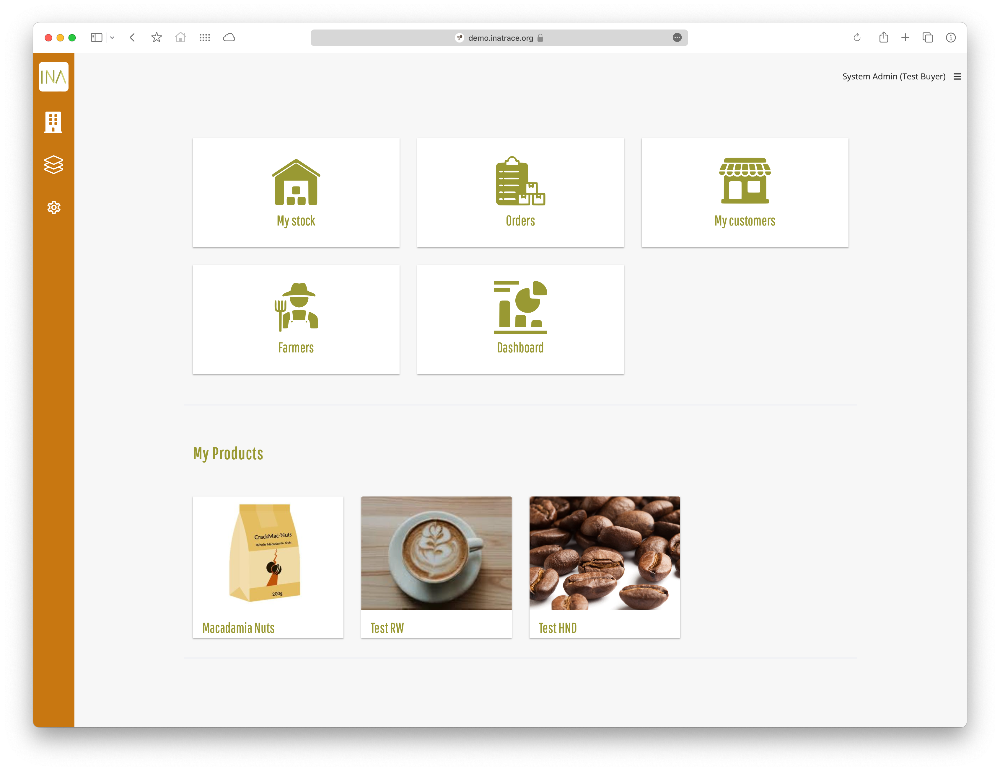
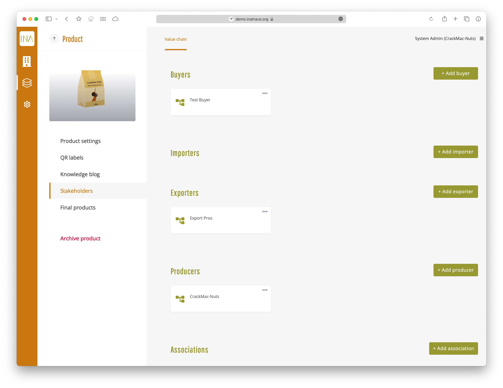
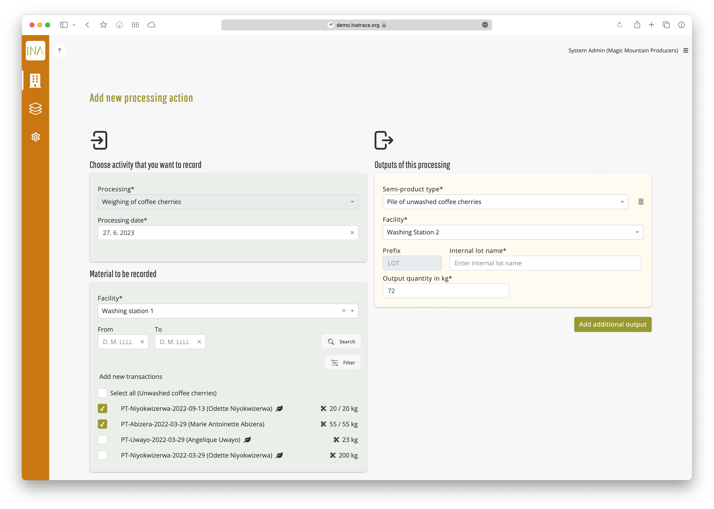
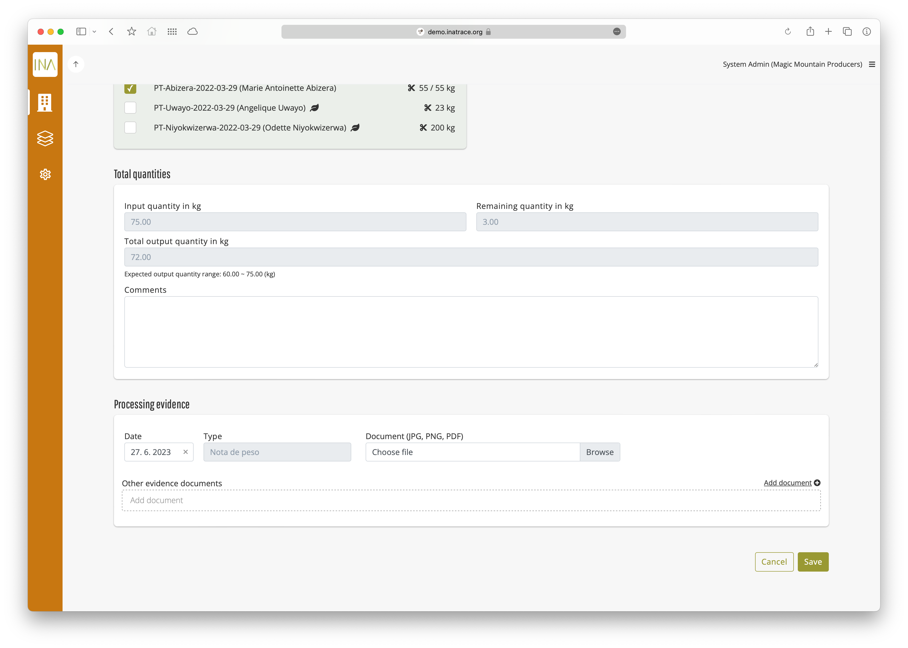
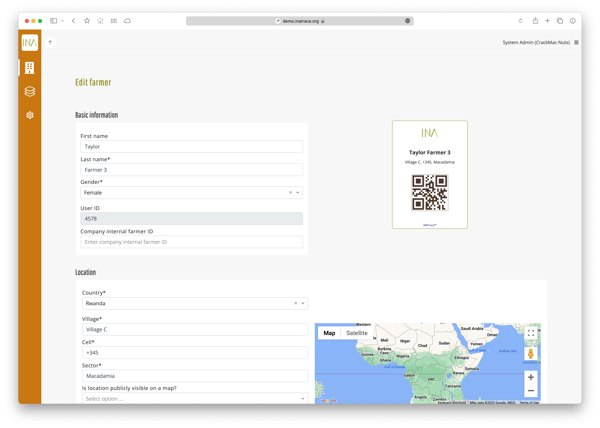
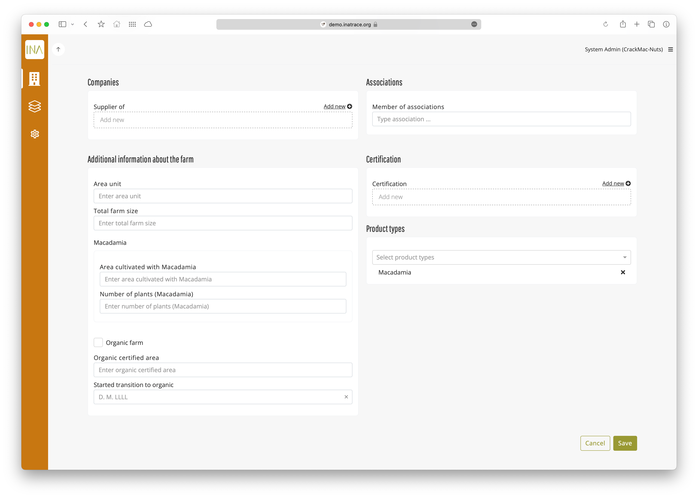
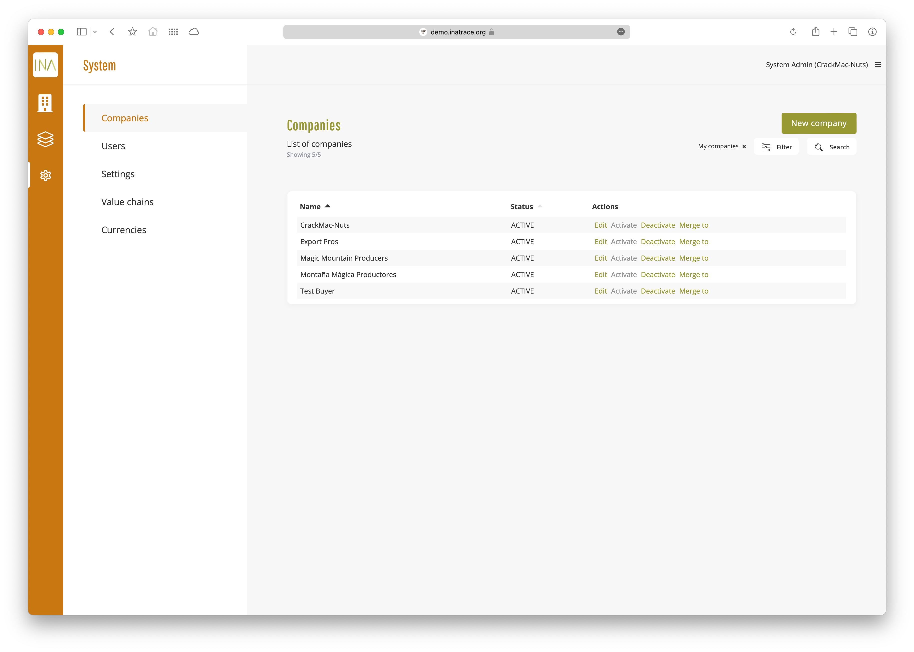
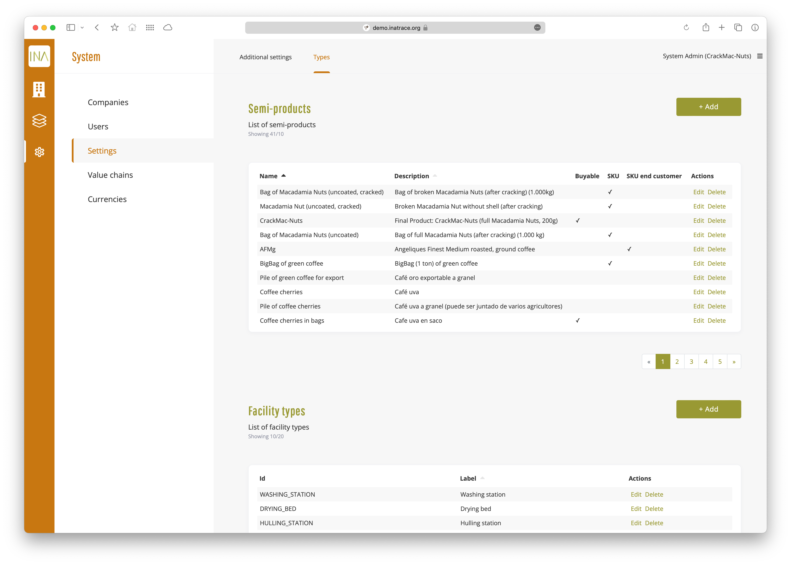

# INATrace

Open-source blockchain-based track and trace system for an agricultural commodities (such as coffee) supply
chain run. It provides transparency and creation of trust through
digitalization of supply chains, connects every actor along the supply chain, assures quality and fair pricing.

Project is composed of 3 parts:

* [Angular frontend](https://github.com/INATrace/fe/tree/main)
* [Java backend](https://github.com/INATrace/backend/tree/main)
* [Coffee network](https://github.com/INATrace/coffee-network/tree/main)

# INATrace 2
This new major release includes new functionalities, refactorings, optimizations and bugfixes. The most important additions and changes are:
* Added support for generic value chains. Different value chains with it's specific settings can now be configured in the system.
* Multi-tenant system support.
* Reorganized the content in the Product section. This section now includes only the content that is related to a product.
* Introduced a new section "Company". This section includes all the content that is related with the company's work process within the value chain.
* The configuration of farmers and collectors is decoupled from the product, and it's part of the Company section.
* Added support for importing farmers from a provided Excel file.
* The company customers are now decoupled from the Stakeholders in the product section and are configured as part of the Company section.
* The configuration of facilities and processing actions is now part of the company's profile.
* The semi-products configuration is now part of the system settings instead of the product section.
* Reorganized the content of the Value chain tab inside the Stakeholders section. The Value chain now includes new company roles. Added is also a section for product admin companies.
* Added support for defining Processing evidence fields in the system settings.
* Translation for facilities, processing actions, semi-products and processing evidence types and fields can be provided in the system as part of it's definition.
* Added support for currencies in the system. The enabled currencies can be selected in the system settings. These currencies then appear as select options in various parts of the system where the user is expected to select a currency.
* Added exchange rates for the enabled currencies that are synced on a daily basis. The currencies data is provided by the https://exchangeratesapi.io/ API.
* The product section now includes Final products. Final products represent the output of a final processing. The final products can be configured by the product admin company.
* When placing customer order, now we select a final product instead of a sellable semi-product.
* Added support for new types of processing actions.
* Added support for bulk purchases for semi-products.
* Various changes and addition of new functionalities for purchases, processing and payments.

# Frontend

## Installing / Getting started

#### Requirements
* Node 14
* Angular 10
* Docker

---

## Despliegue en producción: Nginx y Docker

---

## Aplicar cambios de configuración (nginx.conf)

Cada vez que realices cambios en el archivo `nginx.conf` (o cualquier otro archivo de configuración relevante para el frontend), debes reconstruir la imagen Docker y volver a desplegar el contenedor para que los cambios tengan efecto.

### Pasos para aplicar los cambios:

1. **Construye la nueva imagen del frontend:**
   ```bash
   cd /opt/fe
   ./docker-build.sh inatrace-fe latest
   ```

2. **Detén y elimina el contenedor anterior:**
   ```bash
   docker stop inatrace-fe || true
   docker rm inatrace-fe || true
   ```

3. **Levanta el nuevo contenedor con Docker Compose:**
   ```bash
   cd /opt/fe/.ci
   docker compose --env-file .env -f docker-compose.yml up -d --force-recreate
   ```

4. **Verifica el estado y los logs:**
   ```bash
   docker ps
   docker logs inatrace-fe --tail 100
   ```

### Notas importantes:
- Si el backend (`inatrace-be`) no está corriendo, el proxy `/api/` fallará.
- El archivo `nginx.conf` es la única configuración relevante de Nginx en producción (los otros archivos han sido eliminados para evitar confusión).
- Si necesitas exponer la API a otros orígenes, revisa los headers CORS en el bloque proxy de nginx.conf.

---

- El archivo de configuración de Nginx que se usa por defecto en la imagen Docker del frontend es `fe/nginx.conf`, ya que así está definido en el Dockerfile (`COPY nginx.conf /etc/nginx/nginx.conf`).
- Los archivos `nginx-docker-compose.conf` y `nginx-production.conf` son variantes avanzadas y solo se usan si los montas explícitamente al correr el contenedor (por ejemplo, con `-v $(pwd)/nginx-docker-compose.conf:/etc/nginx/nginx.conf:ro`).
- El archivo `.ci/docker-compose.yml` lanza el contenedor del frontend usando la imagen generada y la configuración interna (`nginx.conf`). No hace bind-mount de ningún archivo de configuración por defecto.
- Si necesitas cambiar la configuración de Nginx en producción, edita `nginx.conf`, reconstruye la imagen y vuelve a desplegar. Si quieres probar una variante, monta el archivo deseado con Docker Compose agregando un volumen.

**Ejemplo de despliegue con Compose:**
```bash
cd fe/.ci
# Asegúrate de que IMAGE_NAME y TAG están correctos en .env
docker compose --env-file .env -f docker-compose.yml up -d --force-recreate
```

**Para usar una configuración alternativa de Nginx:**
Agrega un volumen en docker-compose.yml:
```yaml
    volumes:
      - ../nginx-docker-compose.conf:/etc/nginx/nginx.conf:ro
```

**IMPORTANTE:**
- El proxy de `/api/` es gestionado por Nginx en producción. El frontend Angular solo debe hacer peticiones a rutas relativas (`/api/...`). Los archivos de proxy como `proxy.INATrace-local.conf.json` solo se usan en desarrollo local con Angular CLI (`ng serve`).

---

* WebStorm or VS Code (recommended)
* VS Code pluggins:
  * Debugger for Chrome
  * EditorConfig for VS Code
  * npm support for VS Code
  * HTML Format (from Mohamed)
  * TSLint

#### How to run
1. Clone the repository
	
2. Run ```npm install```

3. Open project in IDE of choice

4. Generate API client from Java backend by running `npm run generate-api`

5. Add development environment as `environment.dev.ts` by copying `environment.ts` and adding default values for configuration keys besides window environment (e.g. `environmentName: window['env']['environmentName'] || 'DEV'`)
   1. `environmentName`: `'DEV'`
   2. `appBaseUrl`: `'http://localhost:4200'`
   3. `qrCodeBasePath`: `'q-cd'`
   4. `relativeFileUploadUrl`: `'/api/common/document'`
   5. `relativeFileUploadUrlManualType`: `'/api/common/document'`
   6. `relativeImageUploadUrl`: `'/api/common/image'`
   7. `relativeImageUploadUrlAllSizes`: `'/api/common/image'`
   8. `googleMapsApiKey`: have to obtain a key yourself

6. If using Beybo integration, add the following configuration keys in `environment.ts` (the values should be obtained from Beyco):
   1. `beycoAuthURL`: `url`
   2. `beycoClientId`: `clientId`

7. Run Angular server with `npm run dev`

## How it works

### Welcome page

This is the welcome page at [inatrace.org](https://inatrace.org/). From here, existing users can login by clicking "Login" in the top right corner. New users can click on "Read more" button, where they can get more info on how to get registered. 


### Registration

New users must enter their name, surname, email and password. The terms and conditions have to be accepted. The submitted email address receives a confirmation link to confirm the email address. After confirming the email, a system admin must activate the account.



### Home



This is the home page. In the left sidebar from top to bottom, we have the following links:
- Home
- Company
- Products
- Settings (System admin and Regional admin only)

The current user's products are displayed in the center, along with quick access links to stock, orders, customers, farmers, collectors and dashboard. Collectors quick access is shown only if the current user company has facilities that work with collectors. Customers quick access is shown only if the current user company has "Buyer" role in any Product. 
In the top right corner, an expandable menu contains quick links, user profile settings and a logout button.

If the user has multiple companies, an active company can be selected in the "User profile" section.


### Products


Each company has its products which are visible in the products tab which is opened by clicking the above icon.

#### Product settings

Each product can contain information like name, picture, origin, data about social responsibility, enviromental sustainability, etc. This is defined in the "Product settings".

#### QR labels

For traceability, QR labels with product information are created here.


#### Stakeholders

Stakeholders are companies participating in the production of the final product. Companies from the system can be added here. Their roles can be:

- Buyer
- Importer
- Exporter
- Producer
- Association
- Processor
- Trader



#### Final products

Final products are retail products for sale to the end customers.


#### B2C settings

The public facing B2C page has editable colors, fonts and content to allow for corporate identity compliance. The settings are visible on `Product settings` and `QR labels` tabs.

The B2C configuration on the `Product settings` is automatically inherited by QR labels. If QR labels define another value, this value overrides the product values. This way QR labels inherit product settings by default, but can be changed on a label-by-label basis.

The following values can be customized:
- Colors
  - Primary
  - Secondary
  - Ternary
  - Quaternary
  - Header
  - Text
- Enable/disable tabs
  - Fair prices
  - Producers
  - Quality
  - Feedback
- Font (TTF, WOFF and WOFF2)
  - Product
  - Text
- Images
  - Header (PNG, JPG and JPEG)
  - Header background (PNG, JPG, JPEG and SVG)
  - Footer (PNG, JPG and JPEG)


### Companies

The currently active company is displayed when opening the company tab. "Deliveries" tab of "My stock" is opened by default.

#### Deliveries

Shows deliveries of semi-products from farmers and collectors. By selecting a facility, new deliveries can be recorded by clicking "Add delivery" or "Add bulk delivery".


#### Processing

This is where processing actions are recorded e.g. roasting green coffee beans to make roasted coffee beans. Input and output items and quantity are defined and processing evidence can be added.




#### Payments

On this tab payments to farmers and collectors are recorded.


#### Farmers and collectors

Here, farmers and collectors with their personal and banking details are recorded. For each farmer and collector there is also an aggregation of past payments. Each person has a unique QR code.




### Dashboard

The Dashboard contains graphical representation of selected Company data. Currently, there is support for display the Deliveries for selected time frame and displaying processing performance for selected Processing action and time frame.

#### Deliveries


#### Processing performance


For every graphical representation section, the user can export the data for the selected parameters in either Excel, PDF or CSV format. 

### Settings

This section is dedicated to system settings. Settings are accessible by clicking the cog icon in the sidebar. This menu is only available for system administrators. Companies, users, value chains, currencies and settings are configured are configured on these pages.

#### Companies

Here, new companies can be added and existing ones can be edited.



#### Users

This is the list of system users. To show all users, the "My users" filter needs to be deactivated. Users can be edited, activated, deactivated and promoted or demoted out of the System admin role. Users can also be set as a Regional admin, which can administer resources owned by the companies where the user is part of.

Users who confirmed their emails can be activated by clicking "Activate". After that, they can login and start using the app.


#### Settings

Under the "Settings" page and "Types" tab, we can find constants and system-level values like Semi-products, Facility types, Measurement units, Processing evidence types, Processing evidence fields and Product types. Add, edit or remove any of these values to fit your use case.



#### Value chains

Value chains are listed on this tab. From here, create a new or edit an existing value chain. Value chains contains Facility types, Measuring unit types and other constants added in the types settings.


#### Currencies

The system supports 168 different currencies, provided by [exchangeratesapi.io](https://exchangeratesapi.io/). To use a currency, a System or Regional admin has to manually activate it before it can be selected in currency lists.

To search for a currency, click the "Search" button above the enabled or disabled list and type the ISO code or full name.  


## Building

Builds are done using Docker with the build script located in `Dockerfile`.

To build, tag and push an image run `docker-build.sh`. See the file for a detailed command syntax.

To build and tag an image localy with name `inatrace-be` and version `2.4.0` run:

```
./docker-build.sh inatrace-be 2.4.0
```

To build and tag an image with name `inatrace-be`, version `2.4.0` and push it to a remote Docker registry `my-docker-registry` run:

```
./docker-build.sh my-docker-registry/inatrace-be 2.4.0 push
```

## Contribution

Project INATrace welcomes contribution from everyone. See CONTRIBUTING.md for help to get started.

## License 

Copyright (c) 2023 Antje ECG d.o.o., GIZ - Deutsche Gesellschaft für Internationale Zusammenarbeit GmbH, Sunesis ltd.

This program is free software: you can redistribute it and/or modify
it under the terms of the GNU Affero General Public License as published
by the Free Software Foundation, either version 3 of the License, or
(at your option) any later version.

This program is distributed in the hope that it will be useful,
but WITHOUT ANY WARRANTY; without even the implied warranty of
MERCHANTABILITY or FITNESS FOR A PARTICULAR PURPOSE.  See the
GNU Affero General Public License for more details.

You should have received a copy of the GNU Affero General Public License
along with this program.  If not, see <http://www.gnu.org/licenses/>.
