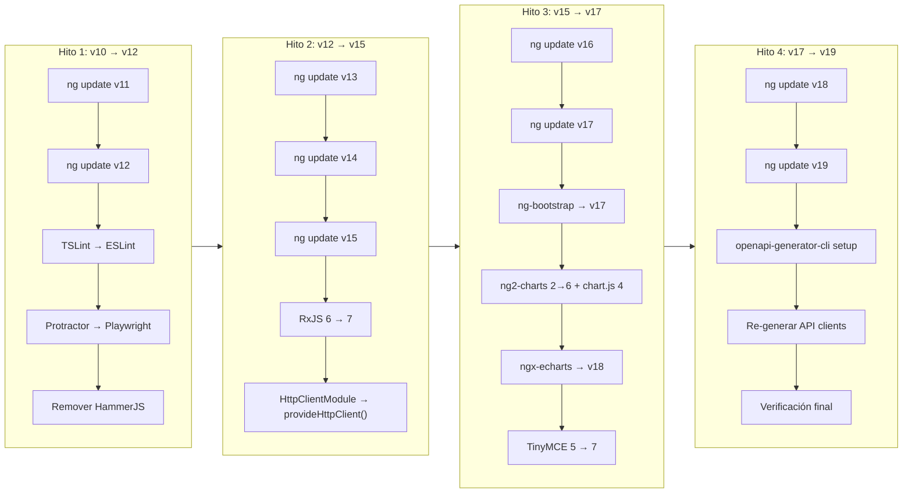

# Design: Upgrade Angular 10 → 19

## Technical Approach

Migración incremental (v10→v11→…→v19) usando `ng update`, agrupada en 4 hitos. Cada hito produce un commit estable con build+lint+tests passing. Se mantiene la arquitectura NgModule existente — no se migra a Standalone API (out of scope).

---

## Architecture Decisions

| Decisión | Opción elegida | Alternativas | Justificación |
|----------|---------------|-------------|---------------|
| Estrategia de upgrade | Incremental `ng update` | App nueva + migrar módulos | Schematics automáticos; menor riesgo de regresiones |
| Linting | ESLint + @angular-eslint | ESLint + custom rules | angular-eslint tiene schematics de migración desde TSLint |
| E2E framework | Playwright | Cypress, WebDriverIO | Más rápido, menor overhead, soporte nativo de Angular CLI desde v17 |
| Charts migration | ng2-charts v6 + chart.js v4 | Migrar todo a ECharts | Minimiza cambios; ng2-charts ya está en uso |
| OpenAPI generator | openapi-generator-cli | Mantener fork actual | Fork en GitHub ref no tiene mantenimiento; openapi-generator-cli es estándar |
| NgModule vs Standalone | Mantener NgModule | Migrar a Standalone | Out of scope; reduce riesgo y complejidad del upgrade |
| HammerJS | Remover en H1 (Angular 13 lo dropea) | Mantener con polyfill | No hay gestos touch complejos en la app |
| RxJS migration | Usar `rxjs-compat` bridge en v12, remover en v13 | Migrar todo manual | Bridge oficial permite migración gradual |

---

## Data Flow — Upgrade Pipeline



---

## File Changes

### Hito 1 (v10 → v12)

| Archivo | Acción | Descripción |
|---------|--------|-------------|
| `package.json` | Modify | @angular/* v12, TypeScript 4.3 |
| `angular.json` | Modify | Remover `extractCss` (deprecado v11), update builders |
| `tslint.json` | Delete | Reemplazado por ESLint |
| `.eslintrc.json` | Create | Config ESLint + @angular-eslint |
| `e2e/protractor.conf.js` | Delete | Reemplazado por Playwright |
| `e2e/tsconfig.json` | Delete | Config de Protractor |
| `playwright.config.ts` | Create | Config Playwright |
| `e2e/` (nuevo) | Create | Tests Playwright para flujos críticos |
| `src/app/app.module.ts` | Modify | Remover `HammerModule`, `HAMMER_GESTURE_CONFIG`, import Hammer |
| `karma.conf.js` | Modify | Actualizar plugins si es necesario |

### Hito 2 (v12 → v15)

| Archivo | Acción | Descripción |
|---------|--------|-------------|
| `package.json` | Modify | @angular/* v15, TypeScript 4.9, RxJS 7 |
| `tsconfig.base.json` | Modify | `target: ES2022`, ajustar `useDefineForClassFields` |
| `src/app/app.module.ts` | Modify | Actualizar imports deprecados |
| `src/app/core/token.interceptor.ts` | Modify | Evaluar nuevo patrón functional interceptor |
| `src/app/core/language.interceptor.ts` | Modify | Idem interceptor |
| `src/polyfills.ts` | Modify | Reducir polyfills (Angular 15 necesita menos) |

### Hito 3 (v15 → v17)

| Archivo | Acción | Descripción |
|---------|--------|-------------|
| `package.json` | Modify | @angular/* v17, ng-bootstrap 17, ng2-charts 6, chart.js 4, ngx-echarts 18, tinymce 7 |
| Componentes con `<canvas baseChart>` | Modify | Adaptar a nueva API de ng2-charts v6 |
| Componentes con `ngx-echarts` | Modify | Actualizar configuración del módulo |
| Componentes con TinyMCE | Modify | Actualizar binding del componente Angular |
| `src/app/app.module.ts` | Modify | `ChartsModule` → `NgChartsModule` (ng2-charts v6) |

### Hito 4 (v17 → v19)

| Archivo | Acción | Descripción |
|---------|--------|-------------|
| `package.json` | Modify | @angular/* v19, TypeScript 5.5+ |
| `generate-api.js` | Modify | Reemplazar invocación del generador por `openapi-generator-cli` |
| `generate-chain-api.js` | Modify | Idem |
| `src/api/` | Regenerate | Re-generar todos los clientes API |
| `angular.json` | Modify | Remover `defaultProject` (deprecado v17) |

---

## Interfaces / Contracts

El módulo principal mantiene su estructura NgModule. Cambios de interfaz clave:

```typescript
// ANTES (ng2-charts v2) — app.module.ts
import { ChartsModule } from 'ng2-charts';

// DESPUÉS (ng2-charts v6)
import { NgChartsModule } from 'ng2-charts';

// ANTES (interceptor class-based)
{ provide: HTTP_INTERCEPTORS, useClass: TokenInterceptor, multi: true }

// DESPUÉS (Angular 15+ — mantener class-based, funcional es opcional)
// Sin cambio obligatorio — class-based interceptors siguen siendo compatibles
```

---

## Testing Strategy

| Layer | Qué testear | Enfoque |
|-------|-------------|---------|
| Build | Compilación sin errores | `ng build --configuration=production` tras cada ng update |
| Lint | Reglas ESLint pasan | `ng lint` — migrar reglas de TSLint a ESLint equivalentes |
| Unit | Tests existentes siguen pasando | `ng test --watch=false` tras cada hito |
| E2E | Flujos críticos | Playwright: login, listado companies, value-chain, product labels |
| Visual | UI sin regresiones | Inspección manual post-hito |

---

## Migration / Rollout

```
main ─────────────────────────────────────────────────────── ···
  \
   chore/angular-migration
     ├── commit: H1-v11 (ng update 11)
     ├── commit: H1-v12 (ng update 12)
     ├── commit: H1-eslint (TSLint → ESLint)
     ├── commit: H1-playwright (Protractor → Playwright)
     ├── TAG: milestone-h1 ← PR review
     ├── commit: H2-v13...v15 + RxJS 7
     ├── TAG: milestone-h2 ← PR review
     ├── commit: H3-v16...v17 + deps UI
     ├── TAG: milestone-h3 ← PR review
     ├── commit: H4-v18...v19 + OpenAPI
     └── TAG: milestone-h4 ← PR review + merge to main
```

Cada milestone es un PR independiente para review. Rollback: `git revert --no-commit <merge-commit>`.

---

## Open Questions

- [ ] ¿El backend OpenAPI spec es generada on-the-fly o hay un archivo `.yaml`/`.json` estático? (afecta cómo se configura `openapi-generator-cli`)
- [ ] ¿`angulartics2` sigue siendo necesario o se puede reemplazar con Google Tag Manager nativo?
- [ ] ¿Qué versión de Node.js está disponible en CI/CD? (Angular 17+ requiere ≥ 18.19)

---

**Status**: success  
**Summary**: Diseño técnico creado para angular-upgrade. 8 decisiones de arquitectura documentadas, 30+ archivos afectados en 4 hitos, diagramas de pipeline y branching strategy incluidos.  
**Artifacts**: `inatrace-frontend/doc/migracion/design-upgrade-angular.md` | Engram `sdd/angular-upgrade/design`  
**Next**: `sdd-tasks`  
**Risks**: Ninguno adicional
